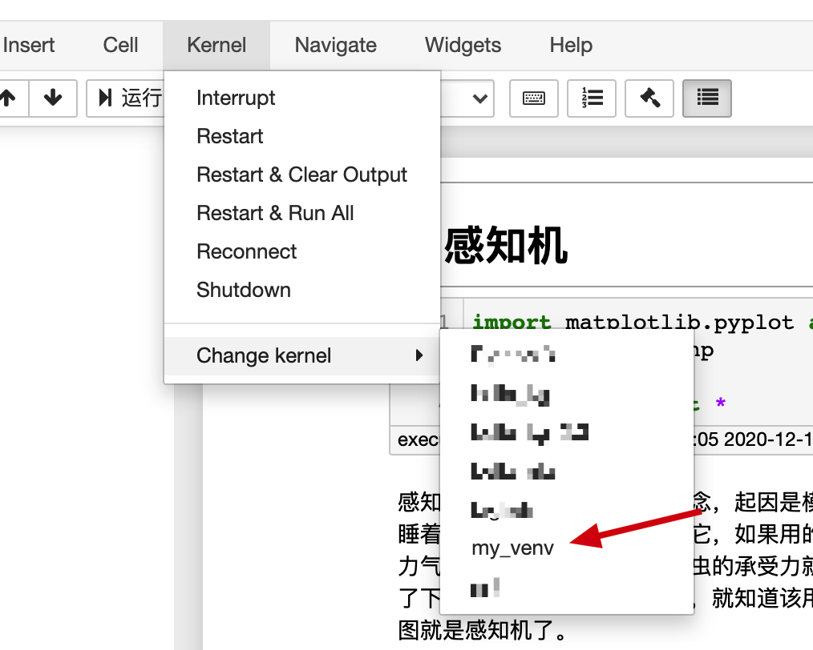

# bigfish

随便取的项目名

博客: https://zy6lc.com

1.下载本项目:

~~~sh
git clone https://github.com/zy6lc/bigfish.git
~~~

2.切换到该项目根目录:

~~~shell
cd ~/xxx/bigfish
~~~

3.最好用conda新建一个虚拟python环境(如何没有安装conda，去清华镜像站下载一个miniconda安装就可以了):

~~~shell
conda create -n my_venv python=3.6
~~~

4.切换到my_venv环境:

~~~shell
source activate my_venv
~~~

5.安装包:

~~~shell
pip install -r requirements.txt
~~~

6.新建一个ipykernel:

~~~shell
python -m ipykernel install --user --name=my_venv
~~~

7.在本项目根目录启动jupyter服务(最后有一个点.别忘记了):

~~~shell
jupyter notebook --notebook-dir .
~~~

8.随便选择一个jupyter notebook；

9.选择第4步你命名的ipykernel名称:

10.就可以在该notebook上运行代码了。